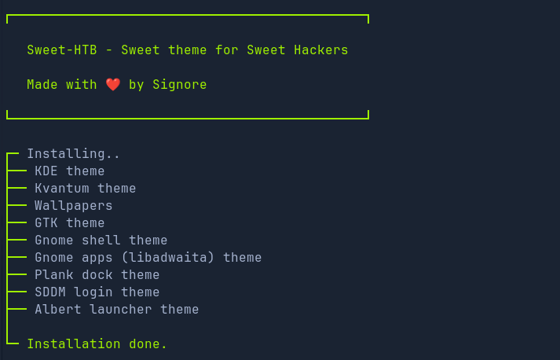

# Sweet-HTB

Modern theme for Hackers, with dark colors - Inspired from the UI of Hackthebox.eu (only for KDE)


## How does it look

### Login Screen


### Splash


### Home


**App view**


## Installation

```shell
git clone https://github.com/the-root-user/Sweet-HTB.git
cd Sweet-HTB
bash install.sh
```


Yes, simple as that.

Enjoy :)
