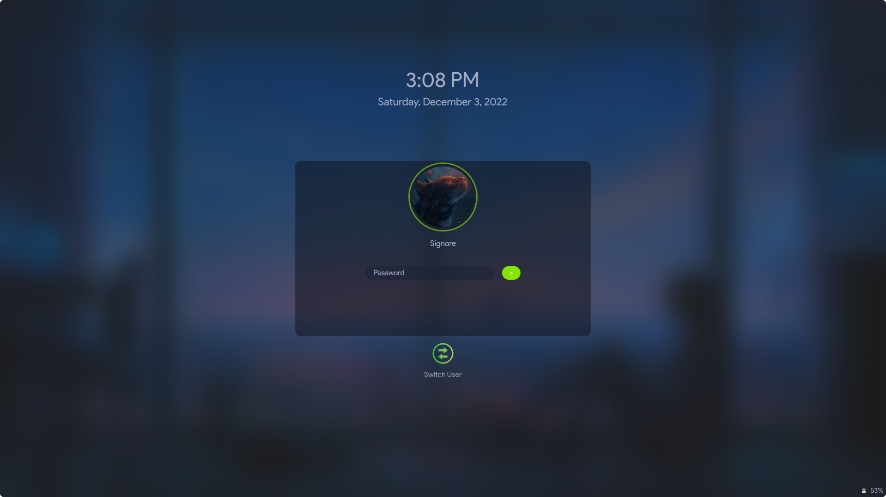

# Sweet-HTB

Modern theme for Hackers, with dark colors - Inspired from the UI of Hackthebox.eu (only for KDE)

Based on the awesome [WhiteSur](https://github.com/vinceliuice/WhiteSur-kde) theme by Vinceliuice


## How does it look

### Login Screen


<!-- ### Lock Sceen
 -->

### Splash


### Home


**App view**


## Installation

```shell
git clone https://github.com/the-root-user/Sweet-HTB.git
cd Sweet-HTB
bash install.sh
```


Yes, simple as that.

Enjoy :)

Hey, wait.. there's more!<br>
There's a file `Dark-Reader-Settings-HTB.json` in this repo. After installing the [Dark Reader](https://addons.mozilla.org/en-US/firefox/addon/darkreader/) add-on in Firefox or any other browser, import the settings from this file into the add-on and enjoy the same dark mode as HTB on almost all other websites on the internet!