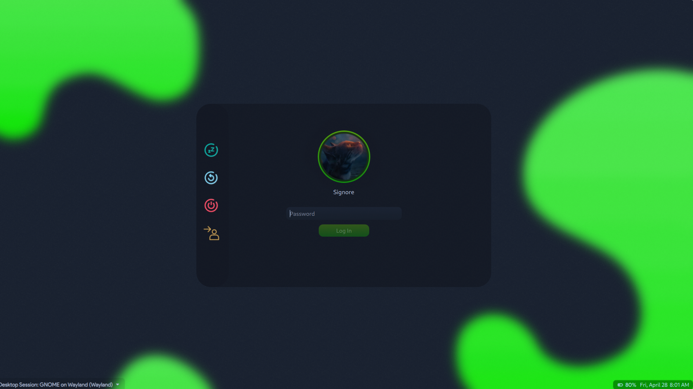
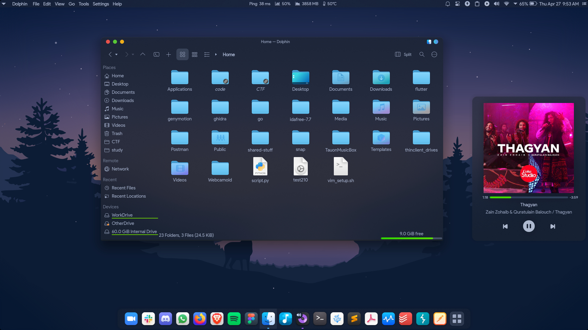

# Sweet-HTB

Sweet theme for Sweet Hackers

Based on the awesome [WhiteSur](https://github.com/vinceliuice/WhiteSur-kde) theme by Vinceliuice<br>
Inspired from the UI of [Hackthebox](https://app.hackthebox.eu)


## How does it look

### Login Screen


<!-- ### Lock Sceen
Used to be like this, but now isn't. Faced some issue after plasma > 5.20 which I'm not sure of.
 -->

### Splash Screen


### Home


**App view**



## Installation

```shell
git clone https://github.com/the-root-user/Sweet-HTB.git && \
cd Sweet-HTB && \
chmod +x install.sh && \
./install.sh
```


Yes, simple as that.<br>
Enjoy :)

But, wait.. there's more!<br>
There's this file [Dark-Reader-Settings-HTB.json](Dark-Reader-Settings-HTB.json) in the repo. After installing the [Dark Reader](https://addons.mozilla.org/en-US/firefox/addon/darkreader/) add-on in Firefox or any other browser, import the settings from this file into the add-on and enjoy the same dark mode as HTB on almost all other websites on the internet! TryHackMe is already in there :)
