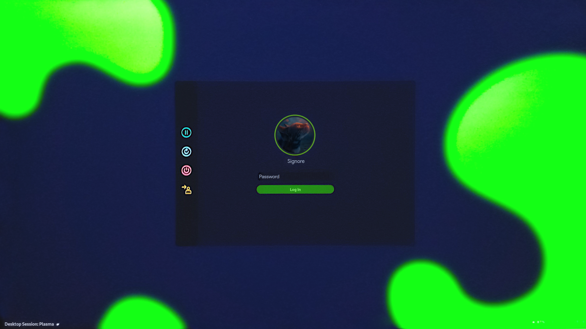

# Sweet-HTB

Modern theme for Hackers, with dark colors - Inspired from the UI of Hackthebox.eu


## How does it look

### Lockscreen


### Splash


### Home


## Installation

```shell
git clone https://
cd Sweet-HTB
bash install.sh
```


Yes, simple as that.

Enjoy :)
